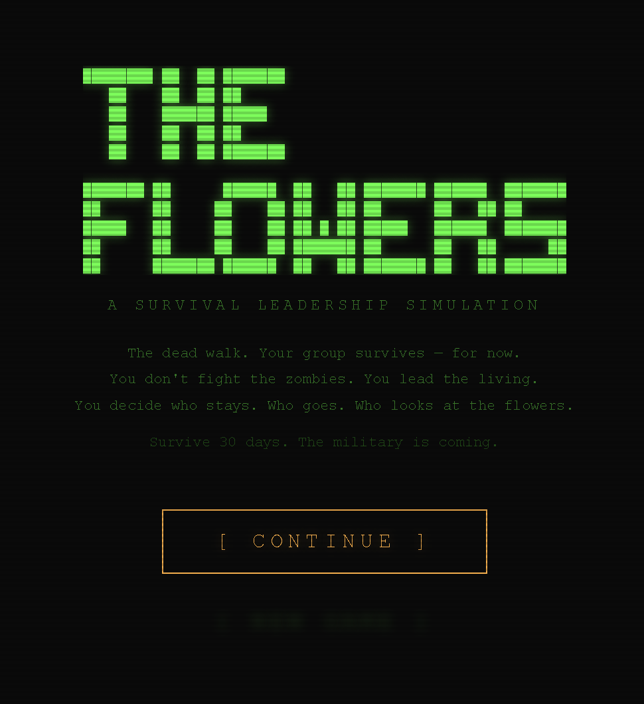
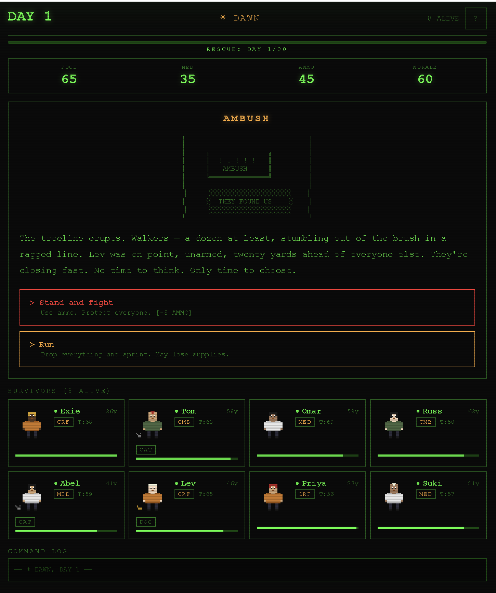

# THE FLOWERS

## 🎮 [Play Now](https://the-flowers-indol.vercel.app/)

**Experience the game live:** https://the-flowers-indol.vercel.app/

A zombie apocalypse survival leadership simulation game built with React and Vite.


*The retro CRT terminal aesthetic - Green phosphor display styled like a 1980s terminal*


*Lead your group through brutal survival decisions - Choose who eats, who gets medicine, who looks at the flowers*

## What Is It

THE FLOWERS is a text-based survival game styled to look like a green phosphor CRT terminal from the 1980s.

You don't fight zombies directly — you lead a group of 8 survivors through 30 days of hard choices. Who eats? Who gets medicine? Who gets exiled? Who has to "look at the flowers"?

The game is driven by 10 brutal survival rules your group lives by. Every few hours (dawn, midday, dusk), an event forces you to make a decision — enforce the rules, bend them, or break them entirely. Your choices affect food, medicine, ammo, morale, and whether your people trust you enough to stay.

Think Oregon Trail meets The Walking Dead.

## Why I Built It

This game started as an idea from my niece. She came up with the concept and the rules, and we turned it into a real, playable game.

The title — "The Flowers" — comes from a recurring phrase in the game: when someone has to be killed due to infection from the zombie virus, they "look at the flowers." It's never explained. You just understand.

## The Real Purpose

This project is strictly for fun and serves as a test of Claude Code's capabilities. The goal was to see how far we could get building a fully functional, playable game with minimal hand-holding — just a design brief and natural language direction.

No prior game dev experience required. Just an idea and a willingness to iterate.

## Tech Stack

- **React 19** — UI and state management (hooks only, no external state libraries)
- - **Vite** — Build tool and dev server
  - - **No UI libraries** — All styling is custom to achieve the retro CRT terminal aesthetic
    - - **No backend** — Everything runs client-side
     
      - ## How to Run
     
      - ```bash
        cd ~/CodingProjects/Zombie\ Survival\ Game/the-flowers
        npm install
        npm run dev
        ```

        Then open [http://localhost:5173](http://localhost:5173) in your browser.

        ## Game Features

        - 10 rule-based event systems (bite checks, child birth, children, combat refusal, defection, pets, body burning, injury/illness timers, and more)
        - - Weighted random event generation based on current game state
          - - 8 procedurally generated survivors with names, ages, skills, trust, morale, and hidden states
            - - Resource management (food, medicine, ammo, morale)
              - - Retro CRT visual effects (scanlines, phosphor glow, flicker)
                - - ASCII art event illustrations
                  - - Difficulty modes
                    - - Full game log tracking every decision
                      - - Win/lose endgame summary
